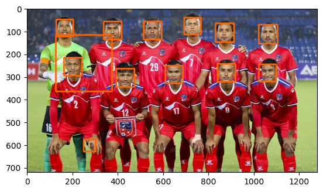

```python
pip install opencv-python
```


```python
import cv2
import matplotlib.pyplot as plt
```


```python

```


```python
img = cv2.imread('nepal_football.jpg')
img_gray = cv2.cvtColor(img, cv2.COLOR_BGR2GRAY)

face_cascade = cv2.CascadeClassifier(cv2.data.haarcascades + 'haarcascade_frontalface_default.xml')
face_img = face_cascade.detectMultiScale(img_gray, scaleFactor = 1.1, minNeighbors = 5)

for (x,y,w,h) in face_img:
    cv2.rectangle(img, (x,y), (x+w, y+h), (0,100,255),5)


img_rgb = cv2.cvtColor(img, cv2.COLOR_BGR2RGB)

plt.imshow(img_rgb)
```


    <matplotlib.image.AxesImage at 0x24af2fa0530>


    

    


```python

```
